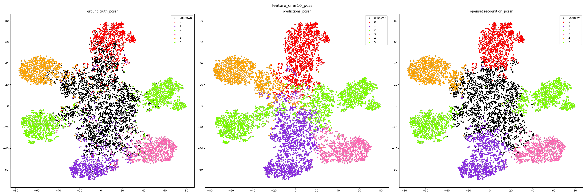

# Reference Papers and Github
- **CSSR**
  - Class Specific Semantic Reconstruction for Open Set Recognition [TPAMI 2022] 
  - Official PyTorch implementation of [Class Specific Semantic Reconstruction for Open Set Recognition](https://github.com/xyzedd/CSSR).
- **CAC**
  - Class Anchor Clustering: a Distance-based Loss for Training Open Set Classifiers
  - Official PyTorch implementation of [Class Anchor Clustering: a Distance-based Loss for Training Open Set Classifiers](https://github.com/dimitymiller/cac-openset)

---
## 0. Setup environment Prepare dataset 

```
python version 3.7.11

$ pip install -r requirements.txt
```
<br/>

Before training, please setup dataset directories in `dataset.py`:
```
DATA_PATH = ''          # path for cifar10, svhn
TINYIMAGENET_PATH = ''  # path for tinyimagenet
LARGE_OOD_PATH = ''     # path for ood datasets, e.g., iNaturalist in imagenet experiment
IMAGENET_PATH = ''      # path for imagenet-1k datasets
```

in case of a tinyimagenet 
```
$ wget http://cs231n.stanford.edu/tiny-imagenet-200.zip
$ mkdir data
$ cd data
$ unzip tiny-imagenet-200.zip
```

---
## 1. Train

- **CSSR**
  - To train models from scratch, run command:
```
python main.py --gpu 0 --ds {DATASET} --config {MODEL} --save {SAVING_NAME} --method cssr --use_neck 
```

- **CAC**
  - To train models from scratch, run command:
```
python main.py --gpu 0 --ds {DATASET} --config {MODEL} --save {SAVING_NAME} --method cssr --use_neck --transfer_learning
```

Command options: 
- **DATASET:** Experiment configuration file, specifying datasets and random splits, e.g., `./exps/$dataset/spl_$s.json`.
- **MODEL:** OSR model configuration file, specifying model parameters, e.g., ./configs/$model/$dataset.json., ./configs/$model/$cac.json. `$model` includes linear/pcssr/rcssr, which corresponds to the baseline and the proposed model.
- **store true ArgsParser**
  - `--head_only`: finetunes only the regressor and the classifier(AutoEncoder)
  - `--use_neck`: Add a neck of PANet between backbone network and classifier(AutoEncoder)
  - `--transfer_learning`: Only use this feature for transfer learning

---

## 2. Evaluation

- **CSSR**
  - Add `--test` on training commands to restore and evaluate a pretrained model on specified data setup, e.g.,
```
python main.py --gpu 0 --ds {DATASET} --config {MODEL} --save {SAVING_NAME} --method cssr --use_neck --test
```

- **CAC**
  - Add `--test` on training commands to restore and evaluate a pretrained model on specified data setup, e.g.,
```
python main.py --gpu 0 --ds {DATASET} --config {MODEL} --save {SAVING_NAME} --method cssr --use_neck --test
```

<br>

---
## 3. Result feature map



- **ground truth**
  - Coloring based on ground truth.
- **predictions**
  - Coloring based on model's predictions before openset recognition
- **openset recognition**
  - Coloring based on openset recognition
